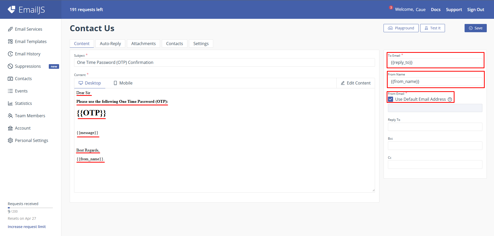
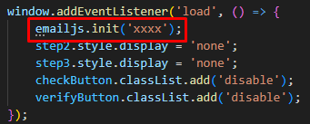
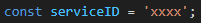
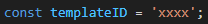
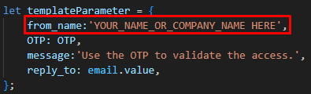

# OTP Validation JS
## 📷 Demo

<video width="70%" height="70%" controls>
    <source src="demo.mp4" type="video/mp4">
</video>

>This project was based on https://www.youtube.com/watch?v=htzSEZh2WzA

## 💻 Requirement

Before begin, verify you have the following requirement:

- Create an account and a template in `EmailJS`.

<h3>Example of Email Template</h3>

## 🔧 Change Variables

<h4>Set EmailJS Init</h4>

>You will access https://dashboard.emailjs.com/admin/account and get the valeu of the `Public Key`.

<h4>Set EmailJS Service ID</h4>

>You will access https://dashboard.emailjs.com/admin and get the valeu of the `Service ID`.

<h4>Set EmailJS Template ID</h4>

>You will access https://dashboard.emailjs.com/admin/templates and get the valeu of the `Template ID`.

<h4>Set Sender Name</h4>

>Change the `from_name` part of the message, you could add a person or company name.

## 🤝 Contribute with the Project

Want to be part of the project? Click [HERE](CONTRIBUTING.md) and read how to contribute.

## 📝 License

This project is under license. See the [LICENSE](LICENSE.md) file for more details.
